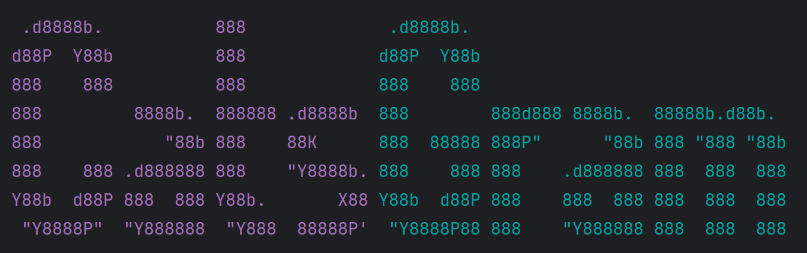
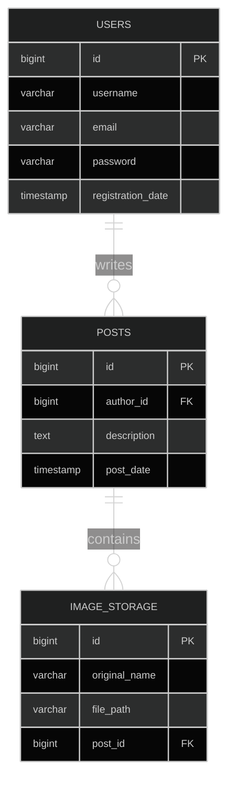

# Catsgram


  

**Инстаграм для питомцев** - учебный проект по REST MVC.  

Основные возможности:
- Добавлять/удалять пользователей
- Оставлять посты от имени пользователя
- Добавлять фото и видео к постам.
- Просматривать посты и их файлы.

### Http API
```text
API
├── ImageController
│   ├── 🌐/posts/{postId}/images
│   │   ├── GET /posts/{postId}/images
│   │   └── POST /posts/{postId}/images
│   └── 🌐/images
│       └── GET /images/{imageId}
├── MovieController
│   ├── 🌐/posts/{postId}/movies
│   │   ├── GET /posts/{postId}/movies
│   │   └── POST /posts/{postId}/movies
│   └── 🌐/movies
│       └── GET /movies/{movieId}
├── PostController
│   └── 🌐/posts
│       ├── GET /posts
│       ├── POST /posts
│       └── PUT /posts
│       ├── GET /posts/{id}
└── UserController
    └── 🌐/users
        ├── GET /users
        ├── POST /users
        ├── GET /users/{userId}
        └── PUT /users/{userId}
```

### Database map
